<picture>
  <source media="(max-width: 600px)" srcset="assets/hero-mobile.svg" />
  
</picture>

### Building dependable products for the real world.

Open to **full-stack**, **backend**, and **product engineering** roles &nbsp;·&nbsp; [**Start a conversation →**](mailto:mbuyabrian290@gmail.com)

[LinkedIn](https://www.linkedin.com/in/brian-mbuya-23225541b) &nbsp;·&nbsp; [Email](mailto:mbuyabrian290@gmail.com) &nbsp;·&nbsp; [GitHub](https://github.com/Brian-Mbuya)

## `~/work` — selected builds

### [Chuka Hostels ↗](https://chukahostels.co.ke) &nbsp; `live`

**A student-housing marketplace processing real KES 150 M-Pesa unlocks.** Built for entry-level Android phones and expensive mobile data; ~95% of traffic is Kenyan and the product ranks on Google for its market. Access is granted only after settlement confirmation, with a no-JavaScript operations path behind it.

`Next.js 16` · `React 19` · `TypeScript` · `Supabase` · `M-Pesa` · `Tailwind`

### [UniSubmit ↗](https://github.com/Brian-Mbuya/unisubmit)

**An academic platform with explainable, six-signal collaborator matching.** Every recommendation shows its reasons and is evaluated with precision@5 and MRR. Hybrid search, duplicate detection, and a deterministic fallback keep the workflow useful without an AI service.

`Spring Boot` · `Java` · `PostgreSQL / pgvector` · `SPECTER2` · `Python`

### [Best Western Plus Meridian ↗](https://best-western-plus-meridian-hotel.vercel.app)

**A magazine-style hotel experience built with the platform, not around it.** Accessible, dependency-light, and responsive, with modular sections and a full-screen gallery in semantic HTML, CSS, and JavaScript.

`Semantic HTML` · `CSS` · `Vanilla JS`

 

More work is pinned below.

