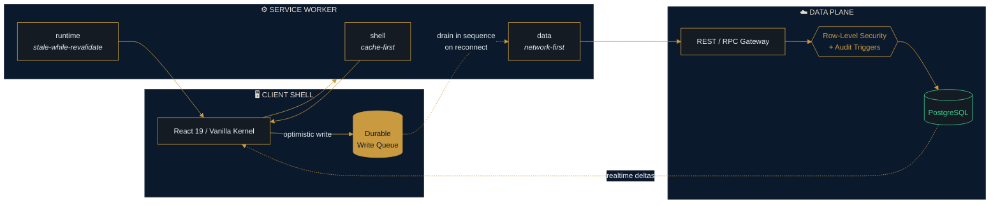
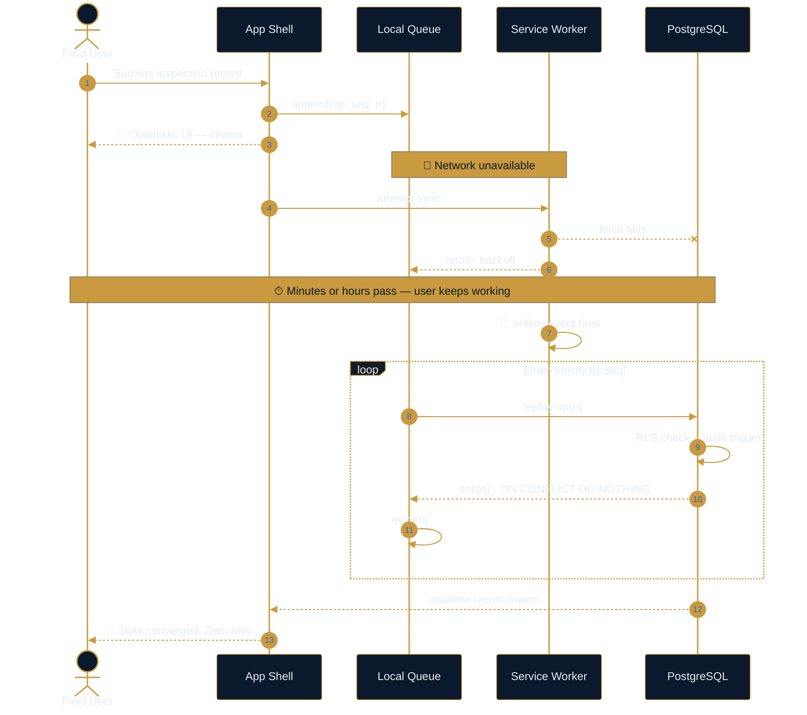
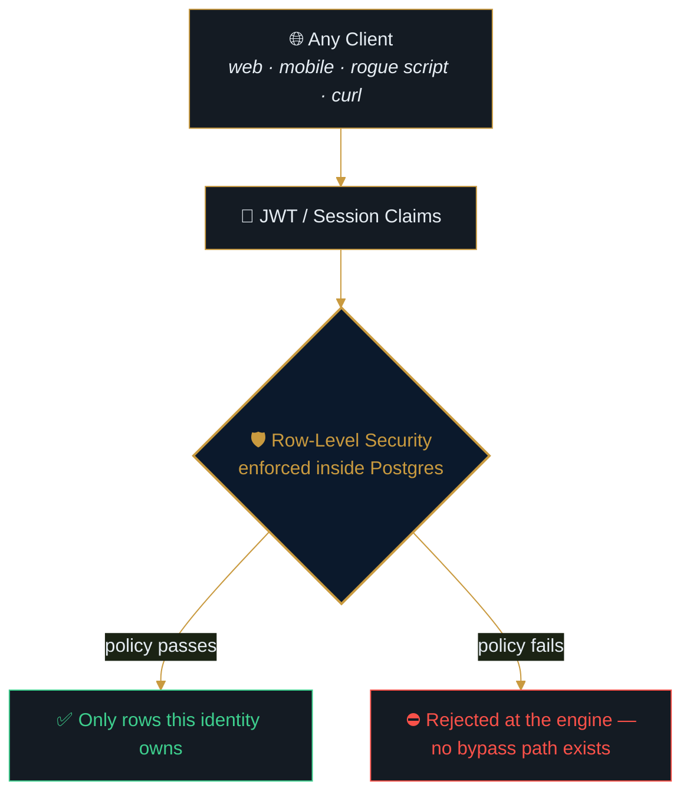
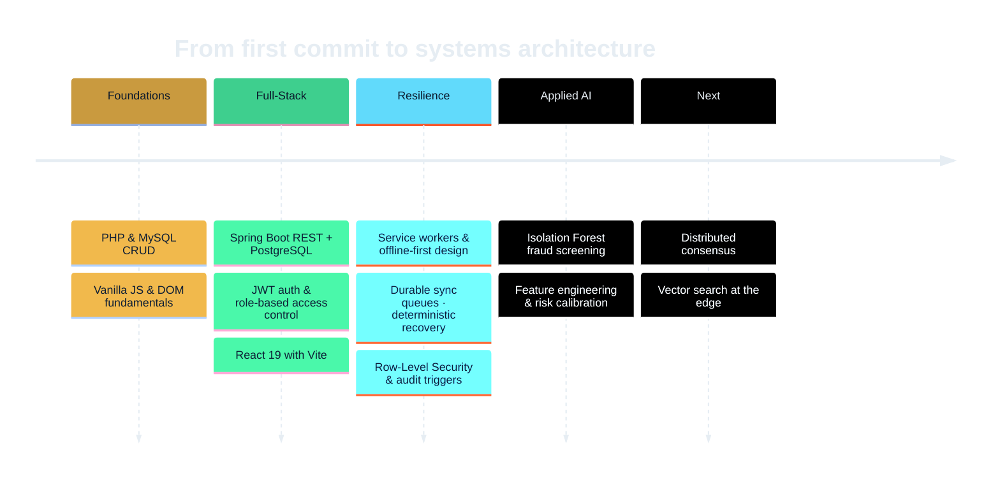

<div align="center">


<a href="https://github.com/Brian-Mbuya">
  
</a>

<br />

<a href="https://www.linkedin.com/in/brian-mbuya-23225541b"></a>
<a href="https://real-estate-web-site-one.vercel.app"></a>
<a href="mailto:mbuyabrian290@gmail.com"></a>
<a href="https://github.com/Brian-Mbuya?tab=repositories"></a>

<br /><br />

<kbd> <a href="#-the-thesis">THESIS</a> </kbd> &nbsp;
<kbd> <a href="#-technical-arsenal">ARSENAL</a> </kbd> &nbsp;
<kbd> <a href="#-systems-i-design">SYSTEMS</a> </kbd> &nbsp;
<kbd> <a href="#-flagship-engineering">PROJECTS</a> </kbd> &nbsp;
<kbd> <a href="#-telemetry">TELEMETRY</a> </kbd>

</div>

---

## ⚡ The Thesis

> [!IMPORTANT]
> **Most apps assume the network.** I build the ones that don't.
>
> My work lives at the intersection of **offline-first resilience**, **database-enforced security**, and **applied machine learning** — systems engineered for environments where connectivity is a suggestion, trust is never assumed, and correctness is proven by tests rather than promised in a README.

```typescript
const brian: Engineer = {
  title:      "Full-Stack Software Engineer & AI Systems Architect",
  location:   "Kisumu, Kenya  🇰🇪",

  specializes_in: [
    "Offline-First PWA Engines",     // deterministic state recovery in dead zones
    "Zero-Trust Data Layers",        // RLS policies + triggers, not client-side guards
    "Applied ML for Fraud",          // unsupervised anomaly detection at scale
    "Multi-Tenant Backends",         // Spring Boot · FastAPI · Supabase · PHP
  ],

  philosophy: {
    resilience: "Degrade gracefully. Never lose the user's work.",
    security:   "If the database doesn't enforce it, it isn't enforced.",
    proof:      "Untested code is a hypothesis, not a feature.",
  },

  currently: {
    building:  "Reality Kisumu Hub — a zero-build PWA property marketplace",
    learning:  "Distributed consensus & vector search at the edge",
    open_to:   "Backend architecture · AI systems · Platform engineering",
  },
} as const;
```

---

## 🧰 Technical Arsenal

<div align="center">

#### Languages & Runtimes


#### Frontend & Progressive Web


#### Backend, Data & Infrastructure


</div>

<details>
<summary><b>📊 Depth calibration — where the hours actually went</b></summary>

<br />

```text
DOMAIN                            PROFICIENCY                 CONTEXT
──────────────────────────────────────────────────────────────────────────────
TypeScript / JavaScript      ███████████████████░  95%   Primary daily driver
Offline-First PWA Design     ██████████████████░░  92%   SW caching · sync queues
PostgreSQL / RLS Policies    █████████████████░░░  88%   Triggers · multi-tenant
React 19 + Vite              █████████████████░░░  87%   Concurrent · Suspense
Python / scikit-learn        ████████████████░░░░  82%   Isolation Forest · feature eng.
Java / Spring Boot           ███████████████░░░░░  78%   JWT · RBAC · REST
Testing (Vitest / JUnit)     █████████████████░░░  86%   248 tests, one repo
PHP / MySQL                  ██████████████░░░░░░  72%   Legacy integration work
──────────────────────────────────────────────────────────────────────────────
```

</details>

---

## 🏗️ Systems I Design

### The Offline-First Architecture

Every app I ship assumes the network **will** fail. This is the pattern:



> [!NOTE]
> **The critical detail is the queue.** Writes are appended to a durable local sequence and drained **in order** on reconnect — not fired in parallel, not best-effort. Ordering is what makes recovery deterministic instead of merely likely.

<details>
<summary><b>🔁 How a write survives a dead zone — full recovery sequence</b></summary>

<br />



**Why idempotency matters here:** an ack lost in transit means the client replays an op the server already committed. `ON CONFLICT DO NOTHING` on a natural key turns that from data corruption into a no-op.

</details>

<details>
<summary><b>🛡️ The security posture — why RLS beats middleware</b></summary>

<br />



Middleware guards protect **one** entry point. An RLS policy protects **every** entry point — including the ones you'll add next year and the ones an attacker finds first. Security that lives in the API layer is a convention; security that lives in the engine is an invariant.

</details>

---

## 🌟 Flagship Engineering

<table>
<tr>
<td width="50%" valign="top">

<h3 align="center">🏨 Inspection &amp; Asset Tracker</h3>
<p align="center">
  
  
  
</p>

<p><b>Enterprise offline-first hotel asset management.</b> Built for staff working inside concrete stairwells with no signal.</p>

<ul>
  <li><b>Durable Sync Queue</b> — sequence-ordered local drain; survives kills, reloads, and hours offline.</li>
  <li><b>Database-Enforced Security</b> — RLS policies plus audit triggers; no privileged client path.</li>
  <li><b>PDF Intelligence</b> — parses Opera PMS exports and diffs them against live state.</li>
  <li><b>248 Unit Tests</b> — data-integrity paths covered before shipping, not after.</li>
</ul>

<p align="center"><a href="https://github.com/Brian-Mbuya/inspection-tracker"><b>⟶ Explore Repository</b></a></p>

</td>
<td width="50%" valign="top">

<h3 align="center">🏠 Reality Kisumu Hub</h3>
<p align="center">
  
  
  
</p>

<p><b>A property marketplace with no bundler, no framework, no build step.</b> ~3.1k lines of hand-tuned vanilla JS.</p>

<ul>
  <li><b>3-Tier Cache Strategy</b> — shell (cache-first), runtime (SWR), data (network-first + offline fallback).</li>
  <li><b>Shared UI Kernel</b> — one <code>propertyCardHTML()</code> renders every surface; single source of truth.</li>
  <li><b>Dual-Currency Engine</b> — KSh/USD toggle with a mortgage &amp; down-payment estimator.</li>
  <li><b>Event Delegation Only</b> — zero inline handlers; stretched-overlay anchors for real navigation semantics.</li>
</ul>

<p align="center"><a href="https://github.com/Brian-Mbuya/real-estate-web-site"><b>⟶ Repository</b></a> &nbsp;·&nbsp; <a href="https://real-estate-web-site-one.vercel.app"><b>Live PWA ↗</b></a></p>

</td>
</tr>
<tr>
<td width="50%" valign="top">

<h3 align="center">🛡️ M-Pesa Fraud Engine</h3>
<p align="center">
  
  
</p>

<p><b>Zero-day fraud screening for mobile money</b> — catches patterns no labelled dataset has seen yet.</p>

<ul>
  <li><b>Isolation Forest</b> — unsupervised detection; no fraud labels required to bootstrap.</li>
  <li><b>Calibrated Risk Scoring</b> — engineered velocity, recency &amp; counterparty-entropy features.</li>
  <li><b>Synthetic Corpus</b> — reproducible simulated transaction streams for evaluation.</li>
</ul>

<p align="center"><a href="https://github.com/Brian-Mbuya/mpesa-fraud-detection"><b>⟶ Explore Repository</b></a></p>

</td>
<td width="50%" valign="top">

<h3 align="center">🎓 UniSubmit Academic Portal</h3>
<p align="center">
  
  
</p>

<p><b>Multi-role submission &amp; review platform</b> with an immutable audit trail.</p>

<ul>
  <li><b>Layered REST Architecture</b> — Spring Boot service/repository separation over PostgreSQL.</li>
  <li><b>Three-Tier RBAC</b> — Student · Lecturer · Admin, enforced at method boundaries.</li>
  <li><b>Immutable Versioning</b> — submissions append, never overwrite. History is evidence.</li>
</ul>

<p align="center"><a href="https://github.com/Brian-Mbuya/unisubmit"><b>⟶ Explore Repository</b></a></p>

</td>
</tr>
</table>

<details>
<summary><b>🔍 More work — production deployments, libraries &amp; automation</b></summary>

<br />

| Project | Stack | What it does |
|:--|:--|:--|
| 🏢 **[Best Western Plus Meridian](https://best-western-plus-meridian-hotel.vercel.app)** | `Vercel` `PWA` | Live production guest-engagement portal serving real hotel traffic. |
| 🎨 **[Adaptive Theme Engine](https://github.com/Brian-Mbuya/adaptive-theme-engine)** | `TypeScript` | Modular runtime theming library — system-preference aware, zero flash-of-unstyled-content. |
| 🤖 **[Local AI Setup](https://github.com/Brian-Mbuya/local-ai-setup)** | `PowerShell` `Ollama` | Automation for orchestrating local LLM environments end-to-end. |

</details>

---

## 📐 Engineering Principles

<table>
<tr>
<td align="center" width="33%">
<h1>🌐</h1>
<h4>Resilience First</h4>
<p><i>Applications must degrade gracefully under dead-zone conditions without losing state. Offline is a first-class mode, not an error screen.</i></p>
</td>
<td align="center" width="33%">
<h1>🔐</h1>
<h4>Security in the Engine</h4>
<p><i>Enforcement belongs in RLS policies and database triggers. A guard in the UI is a suggestion; a guard in Postgres is a law.</i></p>
</td>
<td align="center" width="33%">
<h1>🧪</h1>
<h4>Proof over Promise</h4>
<p><i>Software is complete when core execution paths are verified by automated tests — not when it happens to work on my machine.</i></p>
</td>
</tr>
</table>

> [!TIP]
> **The principle behind the principles:** every one of these trades a little upfront effort for a *removed class of failure*. Ordered queues remove lost writes. RLS removes the forgotten-auth-check bug. Tests remove the silent regression. That's the only kind of complexity worth adding.

---

## 📊 Telemetry

<div align="center">


<br /><br />

<picture>
  <source media="(prefers-color-scheme: dark)" srcset="https://github-profile-summary-cards.vercel.app/api/cards/profile-details?username=Brian-Mbuya&theme=gotham" />
  
</picture>

<br />

<picture>
  <source media="(prefers-color-scheme: dark)" srcset="https://github-profile-summary-cards.vercel.app/api/cards/repos-per-language?username=Brian-Mbuya&theme=gotham" />
  
</picture>
<picture>
  <source media="(prefers-color-scheme: dark)" srcset="https://github-profile-summary-cards.vercel.app/api/cards/most-commit-language?username=Brian-Mbuya&theme=gotham" />
  
</picture>

<br />

<picture>
  <source media="(prefers-color-scheme: dark)" srcset="https://github-profile-summary-cards.vercel.app/api/cards/productive-time?username=Brian-Mbuya&theme=gotham&utcOffset=3" />
  
</picture>

<br /><br />


</div>

<details>
<summary><b>🔧 Self-host the stats & streak cards — kills the 503s permanently</b></summary>

<br />

The widely-used `github-readme-stats.vercel.app` public instance is **chronically over quota** (it returns `503` right now), because every profile on GitHub shares one Vercel deployment and one GitHub API rate limit. `github-profile-trophy` is worse — it returns `402 Payment Required`.

Running your own instance takes about five minutes and gives you your own quota and your own rate limit:

```bash
gh repo fork anuraghazra/github-readme-stats --clone --remote
```

1. Create a **classic GitHub PAT** with only the `public_repo` scope.
2. Import the fork at [vercel.com/new](https://vercel.com/new), and add an env var `PAT_1` set to that token.
3. Deploy. You'll get a URL like `https://brian-stats.vercel.app`.

Then swap it into the Telemetry section — this never 503s, because it's your deployment:

```html
<picture>
  <source media="(prefers-color-scheme: dark)"
    srcset="https://brian-stats.vercel.app/api?username=Brian-Mbuya&show_icons=true&hide_border=true&bg_color=141b23&title_color=c99a3f&icon_color=c99a3f&text_color=e6edf3&include_all_commits=true&rank_icon=github" />
  
</picture>
```

The **streak card** was removed from this README for the same reason. `streak-stats.demolab.com` returns valid SVG, but its cold-start latency was measured at **20s / 7.5s / 1.1s / 26.8s** across four samples — a coin flip, not a widget. Self-host it the same way from [`DenverCoder1/github-readme-streak-stats`](https://github.com/DenverCoder1/github-readme-streak-stats) and it becomes reliable.

> **Why images break on GitHub specifically:** GitHub proxies every external image through `camo.githubusercontent.com` to protect your IP. Camo enforces a short fetch timeout and then **caches the failure** — so one slow response can leave a card broken long after the upstream recovers. Fast, self-hosted endpoints avoid the problem entirely.

</details>

<details>
<summary><b>🐍 Enable the contribution-snake animation</b></summary>

<br />

GitHub can't animate the contribution grid on its own — but an Action can generate the frames and commit them back. Drop this at `.github/workflows/snake.yml` in your `Brian-Mbuya/Brian-Mbuya` profile repo:

```yaml
name: Generate Snake

on:
  schedule:
    - cron: "0 */12 * * *"
  workflow_dispatch:

jobs:
  build:
    runs-on: ubuntu-latest
    permissions:
      contents: write
    steps:
      - uses: Platane/snk@v3
        id: snake-gif
        with:
          github_user_name: ${{ github.repository_owner }}
          outputs: |
            dist/snake.svg
            dist/snake-dark.svg?palette=github-dark

      - uses: crazy-max/ghaction-github-pages@v4
        with:
          target_branch: output
          build_dir: dist
        env:
          GITHUB_TOKEN: ${{ secrets.GITHUB_TOKEN }}
```

Then add this block back into the Telemetry section — it uses `<picture>` so the snake matches the viewer's theme:

```html
<picture>
  <source media="(prefers-color-scheme: dark)"
          srcset="https://raw.githubusercontent.com/Brian-Mbuya/Brian-Mbuya/output/snake-dark.svg" />
  
</picture>
```

</details>

---

## 🗺️ Trajectory



---

## 📬 Let's Build Something

<div align="center">

**Open to backend architecture, AI systems, and platform engineering roles.**
<br />
If you're building something that has to work when the network doesn't — let's talk.

<br />

<a href="https://www.linkedin.com/in/brian-mbuya-23225541b"></a>
<a href="mailto:mbuyabrian290@gmail.com"></a>
<a href="https://github.com/Brian-Mbuya?tab=repositories"></a>

<br /><br />

<i>"Resilience isn't a feature you add. It's an assumption you design around."</i>


</div>
