<picture>
  <source media="(max-width: 600px)" srcset="assets/hero-mobile.svg" />
  
</picture>

### Open to full-stack · backend · product roles &nbsp;→&nbsp; [**Start a conversation**](mailto:mbuyabrian290@gmail.com)

[LinkedIn](https://www.linkedin.com/in/brian-mbuya-23225541b) &nbsp;·&nbsp; [Email](mailto:mbuyabrian290@gmail.com) &nbsp;·&nbsp; [GitHub](https://github.com/Brian-Mbuya)

## `~/work` — a few things I've shipped

### [Chuka Hostels](https://chukahostels.co.ke) &nbsp;·&nbsp; live product

A student-housing marketplace for Chuka University, built for entry-level Android phones paying for data by the megabyte. **Live at [chukahostels.co.ke](https://chukahostels.co.ke), ranking on Google for its market, with ~95% of traffic from Kenya and real KES 150 M-Pesa unlocks.** The paywall is a TypeScript type, not a runtime check — settlement-confirmed payments and a no-JavaScript operations dashboard behind it.

`Next.js 16` · `React 19` · `TypeScript` · `Supabase` · `M-Pesa` · `Tailwind`

### [UniSubmit](https://github.com/Brian-Mbuya/unisubmit)

An academic submission platform with an explainable AI layer: **six-signal collaborator matching with per-signal reasons, measured with precision@5 / MRR** — plus duplicate detection, hybrid search, and honest fallback when no AI service is configured.

`Spring Boot` · `Java` · `PostgreSQL / pgvector` · `SPECTER2` · `Python`

### [Best Western Plus Meridian](https://best-western-plus-meridian-hotel.vercel.app)

A production hotel experience — magazine-style, **accessible (WCAG)**, and dependency-light. Modular sections and a full-screen gallery, no framework in sight.

`Semantic HTML` · `CSS` · `Vanilla JS`

 

More work is pinned right below ↓

