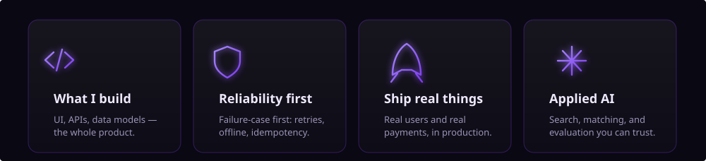

## About

Full-stack engineer building production software for real-world constraints — weak networks, cheap devices, ambiguous payments, and users who can't afford for it to break. I care less about the framework of the month and more about the system still standing when everything that can go wrong, does.

**Stack** &nbsp;·&nbsp; TypeScript · Next.js · React · Tailwind · Java · Spring Boot · PostgreSQL · pgvector · Python · Supabase · Docker

## What I do

---

> [!NOTE]
> **My current projects are pinned right below.** &nbsp; Open to full-stack, backend, and product engineering.
> &nbsp;·&nbsp; **[LinkedIn](https://www.linkedin.com/in/brian-mbuya-23225541b)** &nbsp;·&nbsp; **[Email](mailto:mbuyabrian290@gmail.com)** &nbsp;·&nbsp; **[Repositories](https://github.com/Brian-Mbuya?tab=repositories)**
